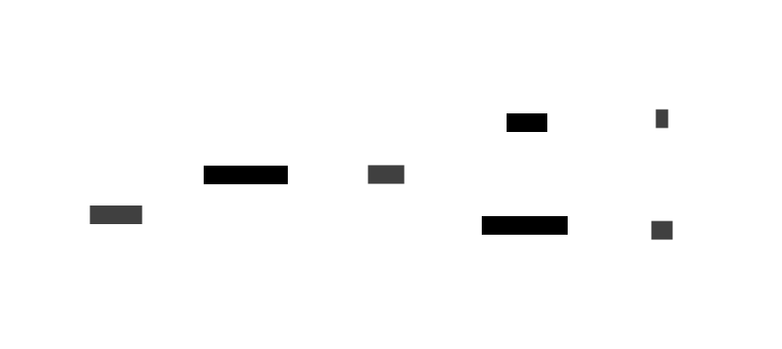

# FP4

This is a new and improved version of the FP3 application.
It is split into two main parts; a backend API and a frontend React application.
Please refer to the readme files in the respective subfolders for details.

See the [Frontend documentation](frontend/README.md) for more details.
See the [Backend documentation](backend/README.md) for more details.

## Basic architecture

