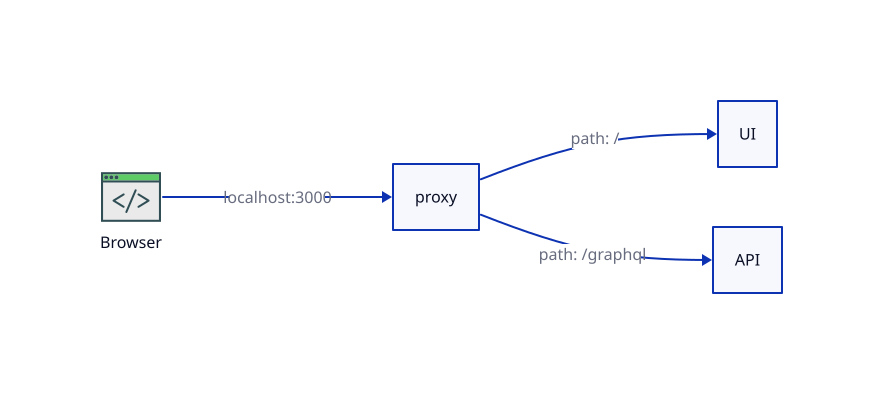

# FP4

This is a new and improved version of the FP3 application.
It is split into two main parts; a backend API and a frontend user interface (UI) built with [React](https://react.dev).

See the [UI documentation](ui/README.md) for more details.
See the [API documentation](api/README.md) for more details.

## Policy connections

The TBS [Enterprise Architecture Framework](https://www.canada.ca/en/government/system/digital-government/policies-standards/government-canada-enterprise-architecture-framework.html) sets the standards by which enterprise architecture teams are to judge new projects.

* "[design systems as highly modular and loosely coupled services](https://www.canada.ca/en/government/system/digital-government/policies-standards/government-canada-enterprise-architecture-framework.html#:~:text=design%20systems%20as%20highly%20modular%20and%20loosely%20coupled%20services)"
* "[use distributed architectures](https://www.canada.ca/en/government/system/digital-government/policies-standards/government-canada-enterprise-architecture-framework.html#:~:text=use%20distributed%20architectures)"
* "[support zero-downtime deployments](https://www.canada.ca/en/government/system/digital-government/policies-standards/government-canada-enterprise-architecture-framework.html#:~:text=support%20zero%E2%80%91downtime%20deployments)"
* "[expose services, including existing ones, through APIs](https://www.canada.ca/en/government/system/digital-government/policies-standards/government-canada-enterprise-architecture-framework.html#:~:text=expose%20services%2C%20including%20existing%20ones%2C%20through%20APIs)"
* "[ensure automated testing occurs](https://www.canada.ca/en/government/system/digital-government/policies-standards/government-canada-enterprise-architecture-framework.html#:~:text=ensure%20automated%20testing%20occurs)"
* "[design for cloud mobility](https://www.canada.ca/en/government/system/digital-government/policies-standards/government-canada-enterprise-architecture-framework.html#:~:text=design%20for%20cloud%20mobility)"
* [validate APIs by consuming what you build](https://www.canada.ca/en/government/system/digital-government/digital-government-innovations/government-canada-standards-apis.html#:~:text=Consume%20what%20you%20build)

This criteria differs significantly from the default 3-tier/monolithic architecture currently in use. Considered [obsolete](https://www.gartner.com/en/documents/3352423#:~:text=three%2Dtier%20application%20architecture%20is%20obsolete) for almost a decade, TBS is ordering departments to adopt more secure and fexible architectures.

> Application architecture practices must evolve significantly for the successful implementation of the GC Enterprise Ecosystem Target Architecture. Transitioning from legacy systems based on monolithic architectures to architectures that oriented around business services and based on re‑useable components implementing business capabilities, is a major shift.

This shift to highly available and [evolvable](https://www.thoughtworks.com/en-ca/insights/books/building-evolutionary-architectures#:~:text=The%20first%20principle%20of%20evolutionary%20architecture%20is%20to%20enable%20incremental%20change%20in%20an%20architecture%20over%20time.) [distributed systems](https://www.freecodecamp.org/news/a-thorough-introduction-to-distributed-systems-3b91562c9b3c#:~:text=simplest%20definition%20is-,a%20group%20of%20computers%20working%20together%20as%20to%20appear%20as%20a%20single%20computer%20to%20the%20end%2Duser.,-These%20machines%20have) is strategically important to support modern service delivery.

## Basic architecture



This application takes a  minimalist approach to microservices and distributed systems. With two independently-deployable services, it meets the most basic definiton of microservices. Deploying these services onto more than one machine then meets the basic definition of a distributed architecture.
This approach allows teams to ease themselves into the shallow end of an area that is considered [complex](https://how.complexsystems.fail) and [hard](https://www.youtube.com/watch?v=w9GP7MNbaRc) but with a large (and much needed) security and availability payoff.
Working in this style requires different [team structures](https://teamtopologies.com/key-concepts), tools and [patterns](https://microservices.io/) which TBS has tried to articulate in it's [Digital Standards](https://www.canada.ca/en/government/system/digital-government/government-canada-digital-standards.html).

## Running the project

### Dev mode

Since this application has a few different parts, we need something to run all of them.
We currently use [Docker Compose](https://docs.docker.com/compose/) (but this should probably switched to [Podman Compose](https://podman-desktop.io/docs/compose) in the future) and describe what "running everything" looks like in the `docker-compose.yaml`.

Docker compose will read that file by default and run the application with the following command:
```sh
docker compose up
```
That file uses some simple docker containers, [inline `Dockerfile` statements](https://docs.docker.com/reference/compose-file/build/#dockerfile_inline) and [bind mounts](https://docs.docker.com/engine/storage/bind-mounts/) to create a nice dev experience.

### Production

It still being early days , it's actually viable to use Docker Compose in production.
There is a second Docker Compose file for that purpose. Since it's not using the default name, you'll have to specify it with the `-f` flag. Note that we've added the `-d` option here to detach the process from the terminal so you can log out and let this run on it's own.

```sh
docker compose -f docker-compose.prod.yaml up -d
```
You'll note that this file is pulling and running containers based on prebuilt [images hosted on GitHub](https://github.com/sleepycat?tab=packages). These images are based on [Googles distroless base images](https://github.com/GoogleContainerTools/distroless?tab=readme-ov-file#distroless-container-images).
We use [`deno compile`](https://docs.deno.com/runtime/reference/cli/compile/) to create a standalone binary, but unfortunately it's not statically compiled, so it needs [glibc](https://www.gnu.org/software/libc/) to run, which leads us to the [distroless cc image](https://github.com/GoogleContainerTools/distroless/tree/main/cc).
The core idea is that these images do not contain a viable operating system, and do not even include a shell, making them largely useless for attackers.

The two images are fronted by an instance of [Caddy](https://caddyserver.com/) running in [reverse proxy mode](https://caddyserver.com/docs/caddyfile/patterns#reverse-proxy). Caddy is interesting because [it automates https](https://caddyserver.com/docs/quick-starts/https).
